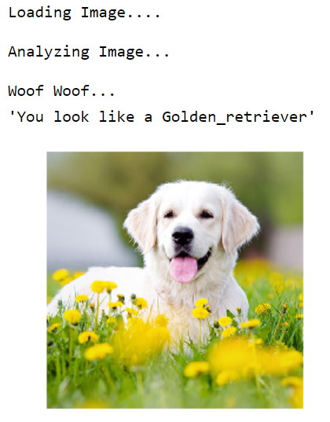
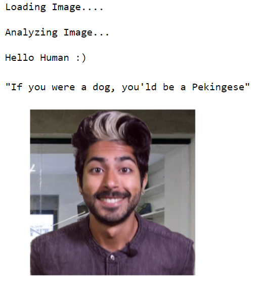
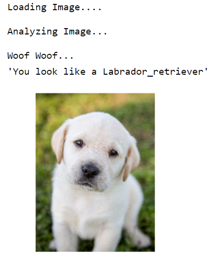

# Project: Dog Breed Classifier

***This repository contains the code for the project "Dog Breed Classifier" using Transfer Learning.***

# Requirements

**1. Python 3.5+**

**2. Jupyter Notebook**

**3. Numpy**

**4. Keras**

**5. Tensorflow**

**6. Matplotlib**

# Result

